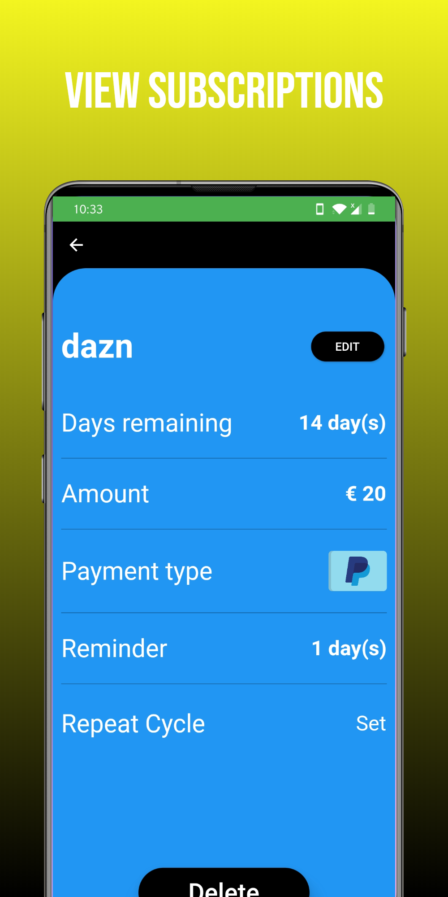
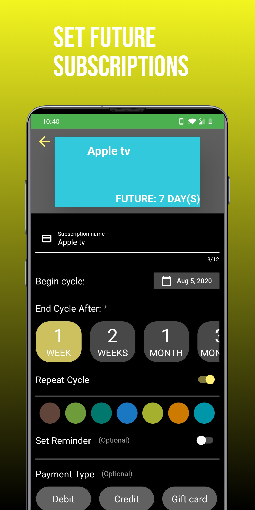
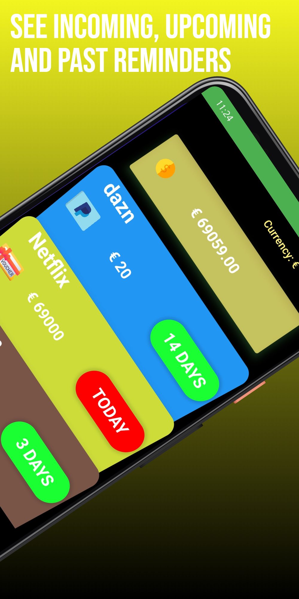

# Pocket subscriptions

Simple application to manage your subscriptions, you can add upcoming subscriptions 

- Add a subscription of your choice

- Customize the beginning and end cycle, add payment option.

- Set a reminder to be notified when due date is coming up.

  

 <u>Credit</u>:

-[Flat icons](flaticon.com)
-[Currency picker] (https://github.com/figengungor/country_pickers)
-[Notifications](https://github.com/MaikuB/flutter_local_notifications)
-[Status bar](https://pub.dev/packages/flutter_statusbarcolor)

